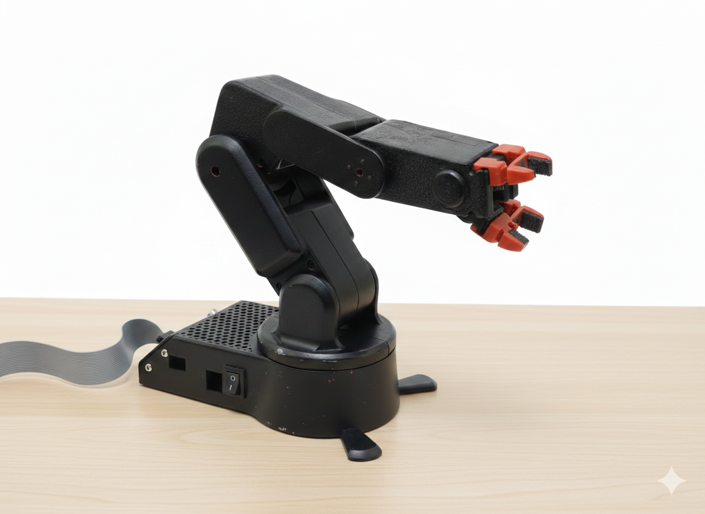

# RoboFlex Educational Robotic Arm

RoboFlex is a 4-DOF robotic arm with simulation and real hardware control on ROS 2.



## Stack

- OS: Ubuntu 24.04 LTS
- ROS 2: Jazzy Jalisco
- Motion planning: MoveIt 2
- Simulation: Gazebo Sim (GZ)
- Hardware transport: plain UDP (one-way motor command stream)

## Workspace Architecture

- [Description](roboflex_ros2/roboflex_description)
  - URDF/Xacro, meshes, worlds, models
- [Control](roboflex_ros2/roboflex_control)
  - ros2_control hardware plugin + controller configs/launches
- [Bringup](roboflex_ros2/roboflex_bringup)
  - Simulation and real-hardware top-level launches
- [MoveIt](roboflex_ros2/roboflex_moveit)
  - MoveIt config and MoveIt-specific launches
- [Pick and Place](roboflex_ros2/roboflex_pick_place)
  - External camera perception + MoveIt scene integration for pick-place
- [Firmware](roboflex_pio)
  - ESP32 PlatformIO firmware (UDP listener)

## Build Workspace
- Make sure usb prot communicatino is allowed
- Pre Reqs
```bash
sudo apt update
sudo apt install -y \
  git build-essential cmake \
  python3 python3-pip python3-venv python3-dev python3-setuptools python3-wheel \
  pipx \
  mesa-utils libgl1-mesa-dri libegl1
pipx ensurepath
pipx install platformio
```
```bash
source /opt/ros/${ROS_DISTRO:-jazzy}/setup.bash
cd ~/ros2_ws
rosdep install --from-paths src --ignore-src -r -y
colcon build --packages-select roboflex_description roboflex_control roboflex_moveit roboflex_bringup roboflex_pick_place
source install/setup.bash
```

## Firmware (ESP32)

Configure and flash from [`roboflex_pio`](roboflex_pio):

```bash
cd ~/ros2_ws/src/RoboFlexv2.1/roboflex_pio
pio run -e prod
pio run -e prod -t upload
pio device monitor -b 115200
```


## Canonical Launches
URDF/joint-limit debug (no hardware required):

```bash
ros2 launch roboflex_bringup sensors_rviz.launch.py
```


Simulation + MoveIt:

```bash
ros2 launch roboflex_bringup simulation.launch.py
```

Real hardware control-only

```bash
ros2 launch roboflex_bringup hardware_gui.launch.py with_moveit:=false
```


## Real hardware + MoveIt:

```bash
ros2 launch roboflex_bringup hardware_gui.launch.py firmware_ip:=10.54.47.26 firmware_port:=9999
```

## Pick and Place (External D455 + MoveIt)

```bash
ros2 launch roboflex_pick_place pick_place_operate.launch.py \
  firmware_ip:=10.54.47.26 firmware_port:=9999 \
  record_bag:=true bag_output_dir:=/home/<user>/bags bag_name:=pick_place_op_01
```

If RealSense is already running in another terminal:

```bash
ros2 launch roboflex_pick_place pick_place_operate.launch.py \
  firmware_ip:=10.54.47.26 start_realsense:=false
```

Compress existing data folders:

```bash
cd /home/<user>/ros2_ws/data/arm_depth
for d in */; do
  d="${d%/}"
  tar -I 'zstd -19 -T0' -cf "${d}.tar.zst" "$d"
done
```
