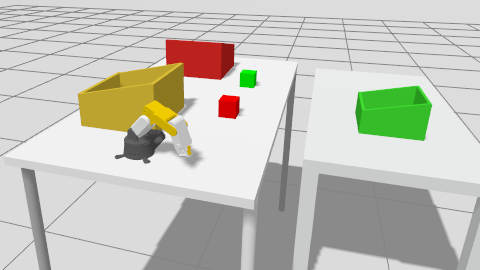

# roboflex_description


This package contains robot description files and launch entry points for simulation and real hardware bringup.

## Use This README When

- You want to know which launch file controls simulation vs real hardware.
- You are troubleshooting ros2_control bringup and controller startup.

## What Is In This Package

- `launch/simulation.launch.py`: Gazebo Sim bringup with robot spawn and controllers
- `launch/real_hardware.launch.py`: Jazzy-compatible ros2_control bringup for hardware
- `config/ros_gz_bridge.yaml`: bridge definitions (`/joint_states` and `/clock`)
- `config/roboflex_controllers.yaml`: simulation controllers
- `config/real_hardware_controllers.yaml`: real hardware controllers (`arm_controller`, `joint_state_broadcaster`)
- `start_controllers`: legacy helper script (not required when using current Jazzy launch flow)

## Guides

- Simulation workflow: [`SIMULATION.md`](SIMULATION.md)
- Real hardware workflow: [`REAL_HARDWARE.md`](REAL_HARDWARE.md)

## Quick Commands

```bash
# Simulation
ros2 launch roboflex_description simulation.launch.py
```

```bash
# Real hardware bringup
ros2 launch roboflex_description real_hardware.launch.py
```

Notes:
- Use either simulation or real hardware in one session, not both at the same time.
- `real_hardware.launch.py` now spawns `joint_state_broadcaster` and `arm_controller` automatically.

## Related Guides

- Project doc map: [`../../../README.md`](../../../README.md)
- MoveIt package guide: [`../roboflex_moveit_config/README.md`](../roboflex_moveit_config/README.md)
