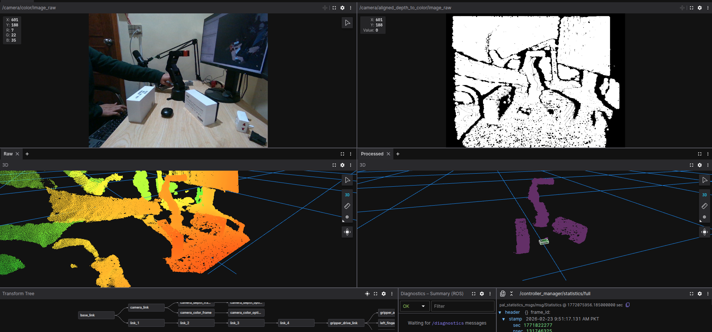

# roboflex_pick_place

Pick-and-place package for RoboFlex with an external Intel RealSense D455 camera.



## Scope

- Keep camera off-robot and observe robot workspace from outside.
- Convert depth point cloud into MoveIt collision geometry in robot base frame.
- Prepare architecture for full pick-and-place (segmentation, grasping, execution).

## Included Now

- `scene_integration_node`: reads `PointCloud2`, transforms points to `base_link`, filters workspace, and updates one collision box in MoveIt PlanningScene.
- `object_segmentation_node`: subscribes to `PointCloud2`, applies ROI + above-table segmentation, and publishes segmented cloud + 3D bounding boxes.
- `object_segmentation_replay.launch.py`: replays a rosbag and runs segmentation on recorded data.
- `external_camera_scene.launch.py`: starts static camera TF and scene integration node.
- `pick_place_hardware.launch.py`: starts real robot + MoveIt stack and scene integration together.
- `pick_place_data_prep.launch.py`: one-command launch for testing scene integration and collecting rosbag data.
- `pick_place_operate.launch.py`: one-command launch for hardware control + MoveIt RViz + RealSense + optional rosbag recording.
- `config/RoboticArm_PNP.json`: Foxglove visualization layout/config for this package.
- `task_list.md`: project task tracker with checkboxes.

## Launch

URDF + TF calibration (recommended first):

```bash
ros2 launch roboflex_pick_place camera_tf_calibration.launch.py
```

Perception + scene integration only:

```bash
ros2 launch roboflex_pick_place external_camera_scene.launch.py
```

Start RealSense D455 point cloud (separate terminal):

```bash
ros2 launch realsense2_camera rs_launch.py \
  camera_namespace:=/ camera_name:=camera \
  pointcloud.enable:=true align_depth.enable:=true
```

Run simple table-top object segmentation (ROI crop + keep points above table):

```bash
ros2 run roboflex_pick_place object_segmentation_node --ros-args \
  --params-file $(ros2 pkg prefix roboflex_pick_place)/share/roboflex_pick_place/config/object_segmentation.yaml
```

Tune these in `config/object_segmentation.yaml`:

- ROI limits: `min_x/max_x`, `min_y/max_y`, `min_z/max_z`
- Table filter: `table_z`, `table_clearance_m` (`filter_above_table:=true`)
- Bounding-box topic: `bbox_topic` (`visualization_msgs/MarkerArray`)
- Bounding-box size limits: `max_object_size_x/y/z` (rejects large clusters like robot arm)

Run segmentation on recorded data (bag replay + segmentation node in one launch):

```bash
ros2 launch roboflex_pick_place object_segmentation_replay.launch.py \
  bag_path:=/home/<user>/bags/pick_place_session_01 \
  pointcloud_topic:=/camera/depth/color/points
```

If you want to replay bag separately and only run node from launch:

```bash
ros2 launch roboflex_pick_place object_segmentation_replay.launch.py \
  start_bag_playback:=false
```

Foxglove visualization:

- Open `roboflex_ros2/roboflex_pick_place/config/RoboticArm_PNP.json` as your layout/config file in Foxglove.
- Add `/camera/depth/color/points_segmented` and `/segmented_objects/bounding_boxes` to visualize segmented objects and boxes.

Test + prepare data in one launch (camera + MoveIt + scene integration, optional bag recording):

```bash
ros2 launch roboflex_pick_place pick_place_data_prep.launch.py \
  record_bag:=true bag_output_dir:=/home/<user>/bags bag_name:=pick_place_session_01
```

Note: `pick_place_data_prep.launch.py` defaults `start_rviz:=false` to avoid RViz robot-model
conflicts when external camera launch files publish their own `model_node`.

If RealSense is already running in another terminal:

```bash
ros2 launch roboflex_pick_place pick_place_data_prep.launch.py start_realsense:=false
```

If you want MoveIt RViz from this launch, first start camera with `rs_launch.py` (not
`rs_d455_pointcloud_launch.py`), then run:

```bash
ros2 launch roboflex_pick_place pick_place_data_prep.launch.py \
  start_realsense:=false start_rviz:=true
```

If your external camera launch is `rs_d455_pointcloud_launch.py`, keep pick-place RViz disabled
to avoid robot-model conflicts from its built-in `model_node`:

```bash
ros2 launch roboflex_pick_place pick_place_data_prep.launch.py \
  start_realsense:=false start_rviz:=false
```

Real robot + MoveIt + external camera scene integration:

```bash
ros2 launch roboflex_pick_place pick_place_hardware.launch.py \
  firmware_ip:=<esp32_ip> firmware_port:=9999 \
  pointcloud_topic:=/camera/depth/color/points
```

Operate robot + plan in MoveIt + see D455 point cloud in the same RViz + optional recording:

```bash
ros2 launch roboflex_pick_place pick_place_operate.launch.py \
  firmware_ip:=<esp32_ip> firmware_port:=9999 \
  record_bag:=true bag_output_dir:=/home/<user>/bags bag_name:=pick_place_op_01
```

If RealSense is already running externally:

```bash
ros2 launch roboflex_pick_place pick_place_operate.launch.py \
  firmware_ip:=<esp32_ip> start_realsense:=false
```

Note: MoveIt RViz config now includes `/camera/depth/color/points`, so use `rs_launch.py`
for camera in this workflow (not `rs_d455_pointcloud_launch.py`, which starts its own RViz/model node).

Record all ROS 2 topics (including hidden/internal topics):

```bash
ros2 bag record -a --include-hidden-topics \
  -o /home/<user>/bags/all_topics_$(date +%Y%m%d_%H%M%S)
```

Record all topics with compression (recommended for long runs):

```bash
ros2 bag record -a --include-hidden-topics -s mcap \
  --storage-preset-profile zstd_small \
  -o /home/<user>/bags/all_topics_zstd_$(date +%Y%m%d_%H%M%S)
```

Compress existing bag folders to `.tar.zst` archives:

```bash
cd /home/<user>/ros2_ws/data/arm_depth
for d in */; do
  d="${d%/}"
  tar -I 'zstd -19 -T0' -cf "${d}.tar.zst" "$d"
done
```

For your current mounting:

```bash
ros2 launch roboflex_pick_place external_camera_scene.launch.py \
  camera_frame:=camera_link camera_x:=0.24 camera_y:=0.0 camera_z:=0.265 \
  camera_roll:=0.0 camera_pitch:=0.261799 camera_yaw:=3.14159
```

## External Camera Calibration

Initial static TF values are launch arguments (`camera_x/y/z`, `camera_roll/pitch/yaw`).
Refine these values from calibration and then update launch defaults or pass them at runtime.

### Practical workflow for tilted/downward D455

1. Launch D455 point cloud in terminal 1:
   `ros2 launch realsense2_camera rs_launch.py camera_namespace:=/ camera_name:=camera pointcloud.enable:=true align_depth.enable:=true`
2. Launch calibration RViz in terminal 2:
   `ros2 launch roboflex_pick_place camera_tf_calibration.launch.py`
3. In RViz:
   - Fixed Frame: `base_link`
   - Add display: `PointCloud2` on `/camera/depth/color/points`
   - Keep `RobotModel` enabled
4. Tune TF args (`camera_x/y/z`, `camera_roll/pitch/yaw`) until point cloud and robot line up.

For an angled-down camera, non-zero pitch is expected. Tilted cloud in camera frame is normal;
what matters is correct alignment in `base_link` frame.

## Current Dataset Status

Captured scenarios:

1. `arm_single_object_20260223_094215`
2. `moving_single_object_20260223_094411`
3. `multi_object_20260223_094553`
4. `wall_object_20260223_095036`

All are recorded as MCAP. Current bags are uncompressed internally (`compression_mode: ""`);
use the archive command above to reduce storage size.

## Pick-and-Place Software Roadmap

Use this execution flow for development:

1. Perception input
   Use `/camera/depth/color/points` (+ RGB if needed) and transform all candidates to `base_link`.
2. Object segmentation
   Replace the current single-box logic with multi-cluster extraction in workspace bounds.
3. Object pose estimation
   For each cluster, estimate centroid + orientation (or 6D pose if model-based).
4. Grasp generation
   Generate grasp poses in object frame, then transform to `base_link`; filter by gripper limits.
5. IK + collision screening
   Test each grasp with MoveIt IK and planning-scene collision checks before planning.
6. Pick sequence execution
   Plan/execute: pre-grasp -> grasp -> close gripper -> lift.
7. Place sequence execution
   Plan/execute: pre-place -> place -> open gripper -> retreat.
8. Recovery logic
   Add retries for failed grasp/plans and fallback to the next grasp candidate.

Recommended ROS 2 node split:

1. `scene_integration_node`
   Keep as environment updater for planning scene.
2. `object_segmentation_node`
   Publish detected object hypotheses (`PoseArray` or custom msg).
3. `grasp_planner_node`
   Subscribe object hypotheses and publish ranked grasp candidates.
4. `pick_place_executor_node`
   State machine that calls MoveIt actions/services and gripper commands.

Record these while developing:

1. Perception
   `/camera/depth/color/points`, `/camera/color/image_raw`, `/camera/aligned_depth_to_color/image_raw`
2. Geometry
   `/tf`, `/tf_static`
3. Planning/execution
   `/planning_scene`, `/move_group/monitored_planning_scene`, `/display_planned_path`
4. Robot state/command
   `/joint_states`, `/arm_controller/state`, `/arm_controller/joint_trajectory`, `/gripper_controller/state`, `/gripper_controller/joint_trajectory`

## Next Implementation Targets

1. Build `object_segmentation_node` with table-plane removal + clustering.
2. Add object hypothesis output topic in `base_link`.
3. Build `pick_place_executor_node` for automatic pick/place sequence.
4. Add obstacle-aware scene updates and run wall/narrow-gap benchmark scenes.
5. Add trial outcome logging (`plan_success`, `pick_success`, failure reason) and evaluate on recorded datasets.
